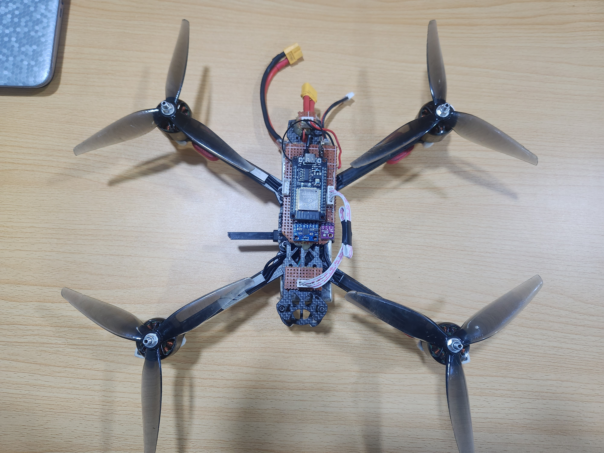
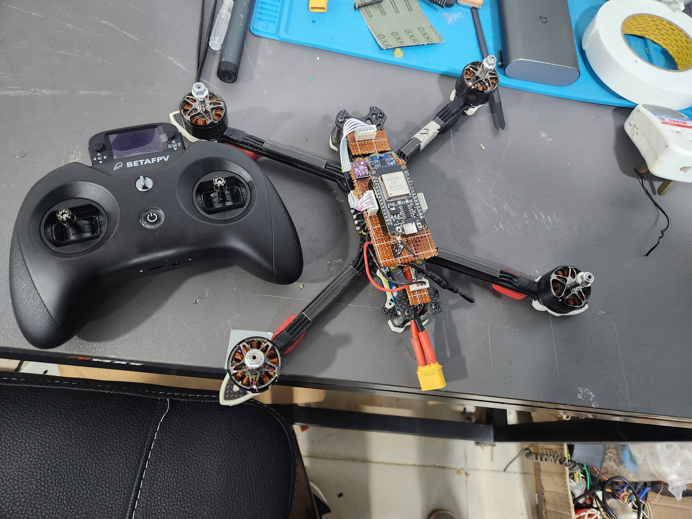

# ESP32 Angle-Mode Quadcopter Flight Controller

> 🎬 **Flight video:** [video.mp4](video.mp4)

---

A custom angle-mode flight controller for ESP32, using DShot300 ESC protocol, MPU6050 IMU, BMP180 barometer, and CRSF (ExpressLRS) RC receiver. Features cascade PID for roll, pitch, and yaw, plus an optional altitude hold mode.

---

## Hardware

| Component | Details |
|---|---|
| Microcontroller | ESP32 |
| IMU | MPU6050 — I²C address `0x68`, ±500°/s gyro, ±8g accel |
| Barometer | BMP180 (via `Adafruit_BMP085` library), `BMP085_ULTRALOWPOWER` mode |
| ESCs | 4× DShot300 (bidirectional off) |
| RC Receiver | ExpressLRS / CRSF, UART2 at 921600 baud |
| Status LED | GPIO 15 |

### Motor Wiring (DShot300)

| Motor | GPIO | Position | Spin |
|---|---|---|---|
| M1 `escFR` | GPIO 33 | Front-Right | CCW |
| M2 `escBR` | GPIO 32 | Rear-Right | CW |
| M3 `escBL` | GPIO 25 | Rear-Left | CCW |
| M4 `escFL` | GPIO 26 | Front-Left | CW |

### I²C

| Signal | GPIO |
|---|---|
| SDA | Default ESP32 SDA |
| SCL | Default ESP32 SCL |

> **Note:** BMP180 is initialized at 100 kHz; the bus is returned to 400 kHz for MPU6050 communication. The clock is also temporarily dropped to 100 kHz for each BMP180 read.

### CRSF Receiver

| Signal | GPIO |
|---|---|
| RX | GPIO 16 |
| TX | GPIO 17 |

---

## Channel Mapping

| Channel | Function |
|---|---|
| CH1 | Roll |
| CH2 | Pitch |
| CH3 | Throttle |
| CH4 | Yaw |
| CH5 | Arm / Disarm switch |
| CH6 | Altitude Hold on/off |

---

## Features

### Angle Mode (self-levelling)
Roll and pitch use a **complementary filter** (τ = 6.0 s) fusing gyro integration with accelerometer-derived angle. The filter is clamped to ±20°.

### Cascade PID
All three axes use a **two-loop cascade** structure:
- **Outer loop** — angle error → desired rate
- **Inner loop** — rate error → motor mix output

### Yaw Heading Hold
Yaw uses a cascade angle PID. Moving the yaw stick rotates the heading target; releasing the stick holds the last heading.

### Altitude Hold (optional)
- Enabled by setting `#define ALT_HOLD_ENABLE 1` (already on by default)
- Activated in flight by CH6 > 1500 µs
- BMP180 sampled at ~10 Hz; the altitude PID is **gated** to run only on fresh samples — prevents integrator windup at the 250 Hz loop rate
- Heavy low-pass filtering applied to both altitude and vertical speed to suppress BMP180 noise

### Auto-Levelling Calibration
On every boot, the controller samples the IMU for 2000 readings to compute gyro bias offsets and the physical mount tilt of the IMU on the frame. No manual calibration is needed.

---

## PID Gains

### Angle (outer loop)

| Axis | P | I | D |
|---|---|---|---|
| Roll / Pitch | 2.0 | 0.2 | 0.05 |
| Yaw | 2.0 | 0.1 | 0.0 |

### Rate (inner loop)

| Axis | P | I | D |
|---|---|---|---|
| Roll / Pitch | 1.1 | 1.5 | 0.0005 |
| Yaw | 4.0 | 0.3 | 0.005 |

### Altitude Hold

| Gain | Value |
|---|---|
| Kp | 5.0 |
| Ki | 4.0 |
| Kd | 0.0 |
| Climb damping | 20.0 |

---

## Build Flags / Feature Toggles

All defined near the top of `Anglemode_flightcontrollerModified.ino`:

| Define | Default | Purpose |
|---|---|---|
| `ALT_HOLD_ENABLE` | `1` | Enable altitude hold (requires BMP180) |
| `MOTOR_TEST_ENABLE` | `0` | Spin each motor in sequence for orientation verification |
| `MANUAL_THROTTLE_MODE` | `0` | Drive throttle from Serial instead of CRSF (bench testing) |

> **⚠ REMOVE PROPELLERS** before using `MOTOR_TEST_ENABLE 1` or `MANUAL_THROTTLE_MODE 1`.

---

## Arm / Disarm

| Action | Condition |
|---|---|
| **Arm** | CH5 > 1500 µs **AND** throttle < 1100 µs |
| **Disarm** | CH5 < 1500 µs **AND** throttle < 1200 µs |

On disarm, all PID integrators and angle states are reset. Motors receive DShot 0.

---

## Throttle Values

| Constant | Value | Purpose |
|---|---|---|
| `ThrottleIdle` | 1140 | Minimum motor speed when armed |
| `ThrottleLanding` | 1100 | Gentle landing floor |
| `ThrottleCutOff` | 1000 | Disarmed (DShot 0 sent) |

---

## Libraries Required

| Library | Install via |
|---|---|
| `DShotRMT` | Arduino Library Manager |
| `Adafruit BMP085 Library` | Arduino Library Manager |
| `Wire` | Built-in |

---

## Loop Rate

The main loop runs at **250 Hz** (4 ms period), enforced with a busy-wait at the end of each iteration. Actual `dt` is measured each loop and clamped to a 50 ms maximum to guard against startup transients.

---

## Serial Debug

All `Serial.print` calls are **commented out** by default to avoid timing jitter on DShot frames. To enable debug output for bench testing, uncomment the relevant blocks in `loop()`. The Serial port runs at **115200 baud**.

---

## Disclaimer

> THE SOFTWARE IS PROVIDED "AS IS" WITHOUT WARRANTY OF ANY KIND. THE USER ASSUMES ALL RISK. Flying multirotors carries risk of injury and property damage. Always fly responsibly and within local regulations.
